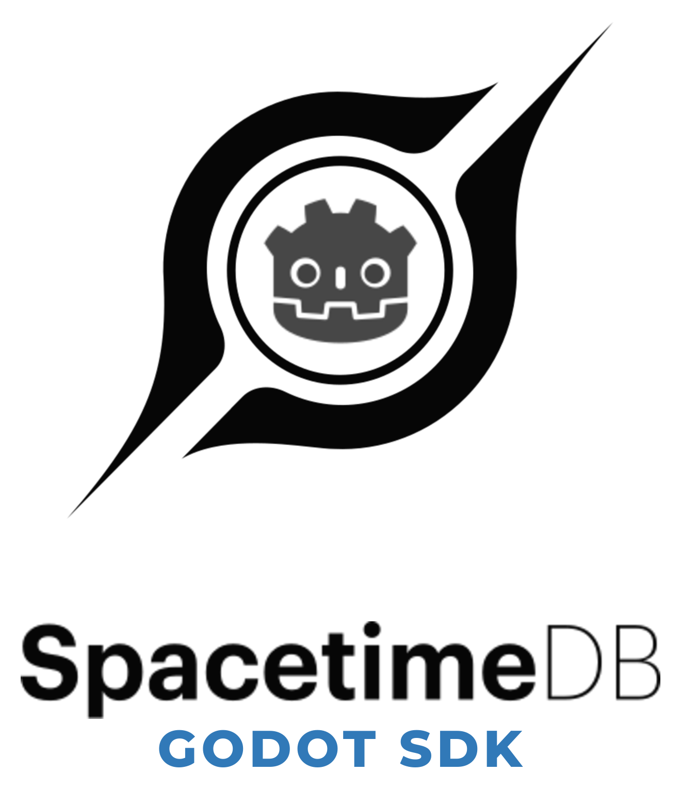

  <picture>
    <source media="(prefers-color-scheme: dark)" srcset="docs/images/logo-lockup-dark.png">
    
  </picture>

## SpacetimeDB Godot SDK

> Requires **SpacetimeDB 2.2.0+** (v3 BSATN protocol, schema v10). Tested with `SpacetimeDB 2.2.0` to `2.6.0`, and `Godot 4.4.1-stable` to `Godot 4.7-stable`. The legacy v2 sub-protocol was dropped in 2.0; for servers below 2.2.0 use an SDK `1.x` release.

A GDScript SDK for integrating Godot Engine with [SpacetimeDB](https://spacetimedb.com), enabling real-time data synchronization and server interaction directly from your Godot client. Built on the BSATN binary protocol (v3 with batched framing, requires server 2.2.0+) with full codegen support.

## Documentation

-   [How to install the SpacetimeDB SDK addon](docs/installation.md)
-   [Quick Start guide](docs/quickstart.md)
-   [Codegen guide](docs/codegen.md)
-   [API Reference](docs/api.md)
-   [Design Decisions](docs/design-decisions.md) — what's built, what's blocked by the wire, what's deliberately out of scope (and why)
-   [Changelog](CHANGELOG.md)

## Features

### Subscriptions

-   **Subscribe / Unsubscribe:** `subscribe()` returns a `SpacetimeDBSubscription` handle with `applied` and `end` signals. `unsubscribe()` sends the request; the `end` signal fires when the server confirms via `UnsubscribeAppliedMessage`.
-   **Subscribe to all tables:** generated module clients expose `subscribe_all_tables()`, which subscribes to every table in the module with a single handle.
-   **Subscription Error Handling:** Server-side subscription errors (`SubscriptionErrorMessage`) are propagated to the subscription handle — `error_message` is set, `end` signal fires, and `wait_for_applied()` resolves immediately with `ERR_DOES_NOT_EXIST` instead of timing out.
-   **Await Helpers:** `wait_for_applied()` and `wait_for_end()` with configurable timeouts. Both resolve immediately if the subscription is already in the target state or if an error/end occurs during the wait.

### Reducers & Procedures

-   **Structured Reducer Error Handling:** `SpacetimeDBReducerCall` with typed `Outcome` enum (OK, OK_EMPTY, ERROR, INTERNAL_ERROR, TIMEOUT, DISCONNECTED). Generated reducers return the handle directly for inspection.
-   **Reducer Return Values:** Reducers that return values expose the raw BSATN bytes via `SpacetimeDBReducerCall.ret_value`, or the typed value via `SpacetimeDBReducerCall.decode()` (generated reducer methods pass the ok-return type automatically).
-   **Procedures:** Full support for SpacetimeDB 2.0 procedures. `SpacetimeDBProcedureCall` with `decode()` for typed return values. Generated wrappers via codegen.

### Data & Queries

-   **One-Off Queries:** `query_sql()` executes a single SQL query without creating a subscription. Returns result rows directly or use the `one_off_query_received` signal.
-   **PK-less Table Storage:** Tables without a primary key are stored in the local DB with hash-based batch delete. `get_all_rows()`, `count_all_rows()`, and RowReceiver work on PK-less tables.
-   **Query Builder:** `SpacetimeDBQuery.table("user").where("online", true).to_sql()` — fluent API with SQL identifier validation and auto-escaping for strings, booleans, and identities. Also `where_in(field, values)` for `IN (...)` and `where_any([[f, v], ...])` for OR groups.
-   **Local DB Query Helpers:** `find_where()`, `first_where()`, `find_by()`, `first_by()`, `count_where()` on table wrappers with typed returns and short-circuit evaluation.
-   **Typed per-field finders:** each table wrapper also generates `find_by_<field>(value)` / `first_by_<field>(value)` for every scalar field — a compile-checked field name and value type and a typed return, instead of the stringly-typed `find_by(&"field", value)`. A finder for a field backed by a **unique index** routes through that index's O(1) cache; other fields use the linear scan.
-   **Indexed lookups:** unique indexes expose a typed `find(value)` (single row); non-unique btree indexes expose a typed `filter(value)` (all matching rows), generated as named accessors on the table wrapper. A btree index over an **orderable** column (`int` / `float` / `String`) also gets `filter_range(from, to)` (inclusive `[from, to]`) plus the one-sided `filter_gte` / `filter_gt` / `filter_lte` / `filter_lt` — all backed by a sorted-key mirror, so they binary-search the window (O(log d + k)) instead of scanning. Bytes-backed keys (`Identity`, `u128`/`u256`) get exact-match `filter()` only, since they have no defined ordering.
-   **Row callbacks:** `on_insert`, `on_update`, `on_delete`, and `on_before_delete` (fires while the row is still in the cache, before removal), plus the matching `row_inserted` / `row_updated` / `row_before_delete` / `row_deleted` signals on the client.
-   **Typed table signals:** each table wrapper also exposes `inserted(row)` / `updated(old_row, new_row)` / `deleted(row)` signals typed to the concrete row class — a table-scoped, editor-discoverable parallel to the `on_*` callbacks.

### Connection & Reliability

-   **Auto-Reconnection:** Exponential backoff with jitter, configurable via `SpacetimeDBConnectionOptions`. Signals: `reconnecting`, `reconnected`, `reconnect_failed`. Subscription queries are automatically restored on reconnect. Existing subscription/reducer/procedure handles are properly invalidated on disconnect.
-   **Compression:** None, GZIP, and Brotli supported (Brotli decoded via Godot's built-in decoder). Set via `SpacetimeDBConnectionOptions.compression`.
-   **Light mode & confirmed reads:** `SpacetimeDBConnectionOptions.light_mode` requests minimal subscription updates; `confirmed_reads` waits for durable commit before the server sends an update.
-   **Frame-Budgeted Apply:** Incoming row updates are applied under an adaptive per-frame time budget (fps-aware auto-tune, with a hard message ceiling), so large bursts — initial subscriptions, mass updates — drain across frames instead of stalling one. Tunable via `SpacetimeDBConnectionOptions` (`frame_budget_us`, `max_messages_per_frame`, `auto_tune_frame_budget`). BSATN parsing runs on a background thread by default (`threading`).
-   **Request latency stats:** `get_stats()` returns a `SpacetimeDBStats` tracking per-request round-trip time bucketed by category (reducer / procedure / one-off / subscribe) — count, min/max/avg/last latency, and in-flight count. `get_stats().summary()` dumps all four; `get_stats().get_tracker(SpacetimeDBStats.Category.REDUCER)` reads one. Always-on (one `Time.get_ticks_usec` + two dict ops per request), main-thread, bounded pending set.

### Serialization

-   **Deep Nesting:** Arbitrary nesting of `Option<T>` and `Vec<T>` types: `Option<Option<T>>`, `Vec<Vec<T>>`, `Option<Vec<Option<T>>>`, etc. Recursive BSATN prefix-based serialization/deserialization.
-   **Native GDScript Types:** Vector2, Vector2i, Vector3, Vector3i, Vector4, Vector4i, Quaternion, Color, and Plane are serialized as native GDScript types via codegen. Rust enums map to `RustEnum` with generated constants.
-   **Tagged-sum (enum-with-payload) columns:** Rust enums with per-variant data round-trip as `RustEnum` values (`value` = tag, `data` = payload), read and write. Anonymous inline `Result<T, E>` columns are supported too — codegen synthesizes a named `RustEnum` type per distinct `Result<T, E>`. Verified end-to-end against a live server (see [`integration-tests/`](integration-tests/)).
-   **Extended scalar types:** `i128` / `u256` / `i256` (raw `PackedByteArray`), `Uuid` (reuses the `u128` wire path), and `ScheduleAt` (the `Interval | Time` tagged union on `#[scheduled]` tables, exposed as a `ScheduleAt` resource). Verified byte-exact end-to-end against a live SpacetimeDB 2.6.0 server (see [`integration-tests/`](integration-tests/)).

## Known Limitations & Caveats

-   **`TimeDuration` and `Timestamp` surface as `int` microseconds — by design.** Both are an `i64` micro count on the wire; the SDK keeps them POD and you convert at the call site for a typed view. Full rationale (and why `ScheduleAt` *is* wrapped) in [Design Decisions](docs/design-decisions.md#data-shape-choices).
-   **WebSocket keepalive default is 15s:** a main-thread stall longer than the configured `heartbeat_interval_seconds` makes Godot's `WebSocketPeer` miss a pong and close the socket (the close happens in the engine; the SDK cannot prevent it). The SDK *detects* this — a poll-gap at or beyond the heartbeat window arms a guard, and an abnormal close inside that window is classified as stall-induced and emitted as `connection_stalled` instead of `connection_error`, so it reconnects immediately with no backoff ramp rather than treating it as a network drop. Tune the interval, or set it to `0` to disable keepalive entirely, via `SpacetimeDBConnectionOptions`.
-   **Reducer-event caller identity, connection id, and energy are not exposed — they are not on the wire.** SpacetimeDB stripped `caller_identity`, `caller_connection_id`, `energy_quanta_used`, and `total_host_execution_duration` from `TransactionUpdate` when it cut the v1 protocol; the v2/v3 `TransactionUpdate` is *only* a list of per-query-set row deltas (`struct TransactionUpdate { query_sets }`), and `EnergyQuanta` is referenced solely by the v1 message set. Because this SDK speaks `v3.bsatn.spacetimedb` (v3 reuses v2 message bodies verbatim, batched per frame), there is nothing to parse — the SDK already reads 100% of the v2/v3 fields. This is not a Godot limitation; the Rust, C#, and TypeScript SDKs are equally blind (a C# `EnergyConsumed` field exists but is hard-wired `null` for this reason). A row callback fired by *another* client's reducer genuinely cannot know who caused it. The only recoverable sender is *your own* call, by correlating `ReducerResult.request_id` with the `CallReducer` you issued — which `SpacetimeDBReducerCall` already gives you. Surfacing remote-caller identity needs an upstream protocol change (a hypothetical v4 re-adding the field), not SDK work.
-   **No "out of energy" reducer outcome — it folds into an error.** The v2/v3 `ReducerOutcome` has four variants only: `Ok`, `OkEmpty`, `Err(bytes)`, `InternalError(string)`. There is no distinct out-of-energy status on the wire; a server-side energy exhaustion arrives as `InternalError` (or `Err`) carrying a message. `SpacetimeDBReducerCall.Outcome` mirrors the wire exactly (`OK` / `OK_EMPTY` / `ERROR` / `INTERNAL_ERROR`, plus the client-side `PENDING` / `TIMEOUT` / `DISCONNECTED`). Inspect the error text if you need to detect it; there is no enum value to branch on, and adding one would invent a distinction the server does not send.
-   **Reducer call flags (`NoSuccessNotify` / `FullUpdate`) are not supported — the wire accepts only `Default`.** v2/v3 `CallReducerFlags` is a single-variant enum (`enum CallReducerFlags { Default }`); the server rejects any other byte. The flags that let a high-frequency reducer skip its result message (a tempting bandwidth win for per-frame game reducers) existed in v1 and were removed. `CallReducerMessage` exposes the `flags` field and mirrors the wire's single `Default` value (`core_types/client_message/call_reducer.gd`). No SDK (Rust/C#/TypeScript) offers per-call flag tuning either, for the same reason. Reinstating fire-and-forget reducers needs an upstream protocol change.

## Contributing

See [`CONTRIBUTING.md`](CONTRIBUTING.md) for the local workflow — running the test suite (`godot-client/run_tests.sh`), enabling the pre-push gate, and regenerating codegen golden files.

Code of Conduct: Adhere to the Godot [Code of Conduct](https://godotengine.org/code-of-conduct/) and [GDScript style guide](https://docs.godotengine.org/en/stable/tutorials/scripting/gdscript/gdscript_styleguide.html). As a contributor, it is important to respect and follow these to maintain positive collaboration and clean code.

## Support

If this SDK saves you time, you can support its development on Ko-fi:

## License

MIT. This is a hard fork of the original [SpacetimeDB Godot SDK by flametime](https://github.com/flametime/Godot-SpacetimeDB-SDK), maintained independently; the original copyright is retained in [`LICENSE`](LICENSE).
